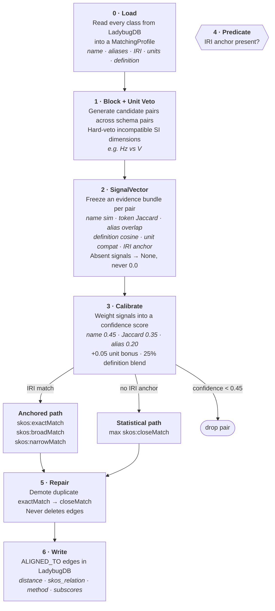

<h1 align='center'>NeuroGhost</p>

<h3 align='center'>A shared vocabulary for neuroscience data</h3>

<p align='center'></p>

---

**NeuroGhost** is a public catalog of neuroscience vocabularies. Labs publish their [LinkML](https://linkml.io/) schema; the registry compares it to every other schema and surfaces which terms mean the same thing across projects.

**Distance score** — 0.0 = identical, 1.0 = unrelated. Computed via the Proteus pipeline: name similarity, token Jaccard, alias overlap, definition embeddings, IRI anchor, and unit dimensional veto. Adjustable live on the Concepts page.

---

## Website

**[sensein.group/NeuroGhost](https://sensein.group/NeuroGhost/)** — seven tabs: **Concepts**, **Diff**, **Graph Schema**, **Transform**, **Query**, **Provenance**, **Register**. Every view has download buttons.

---

## API

Static JSON via GitHub Pages — no auth, no rate limits, CORS open.

| Method | URL | Status |
|--------|-----|--------|
| `GET` | [`/data/registry.json`](https://sensein.group/NeuroGhost/data/registry.json) | ✅ Live |
| `GET` | [`/data/versions/{version}.json`](https://sensein.group/NeuroGhost/data/versions/1.7.0.json) | ✅ Live |
| `GET` | [`/data/provenance.json`](https://sensein.group/NeuroGhost/data/provenance.json) | ✅ Live |
| `GET` | `/api/transform?from={schema}&to={schema}` | 🔜 Planned |
| `POST` | `/api/transform` | 🔜 Planned |

`distance`: **0.0** = identical · **1.0** = unrelated.

<details>
<summary>Response shapes</summary>

**`GET /data/registry.json`**
```json
{
  "registry_version": "1.7.0",
  "generated_at": "2026-07-23T12:40:24Z",
  "sources": [{ "label": "bbqs", "version": "1.0.0", "class_count": 29 }],
  "classes": [{
    "hash_id": "sha256:abc123...",
    "iri": "https://registry.sensein.io/obj/Subject",
    "name": "Subject",
    "definition": "A research participant.",
    "sources": ["bbqs"],
    "properties": [{ "hash_id": "sha256:def456...", "name": "age", "value_range": "xsd:integer" }],
    "alignments": [{ "target_name": "Participant", "distance": 0.12, "method": "composite" }]
  }]
}
```

**`GET /api/transform?from=bbqs&to=bids`** *(planned)*
```json
{
  "from": "bbqs", "to": "bids",
  "mappings": [{
    "from_class": "Subject", "to_class": "Participant", "distance": 0.12,
    "field_mappings": [
      { "from_field": "subject_id", "to_field": "participant_id", "confidence": 0.85 }
    ]
  }]
}
```

**`POST /api/transform`** *(planned — needs serverless layer)*
```bash
curl -X POST https://sensein.group/NeuroGhost/api/transform \
  -H "Content-Type: application/json" \
  -d '{ "from": "bbqs", "to": "bids", "data": { "subject_id": "sub-01", "age": 24 } }'
```
</details>

---

## How alignment works

The pipeline below is the **Proteus alignment design** ([github.com/neurovium/Proteus](https://github.com/neurovium/Proteus)) — it describes how alignment is meant to work, not what currently runs inline. [`neuro_ghost/align.py`](neuro_ghost/align.py) itself is a **minimal placeholder**: it writes `ALIGNED_TO` (`skos:exactMatch`) edges only between classes that share an exact `class_uri`. The full pipeline — multi-signal scoring, embeddings, unit compatibility, structural repair — is meant to be sourced from Proteus's own `proteus-align` package (tracked below) rather than kept as an inline copy that needs updating every time the meta-model changes.



---

## Adding a schema

1. Write a LinkML `.yml` file (copy `schemas/bbqs.yml` as a template).
2. Go to the [Register tab](https://sensein.group/NeuroGhost/), paste your YAML, click **Open GitHub Issue**.
3. A GitHub Action validates, ingests, aligns, and archives it within minutes.

No installation, no pull request, no reviewers required.

---

## Running locally

```bash
git clone https://github.com/sensein/NeuroGhost.git
cd NeuroGhost
pip install -r requirements.txt
```

```bash
python neuro_ghost/pipeline.py --fresh                              # full rebuild
python neuro_ghost/pipeline.py --fresh --skip-converters            # local schemas only
python neuro_ghost/pipeline.py --skip-converters --schemas schemas/bbqs.yml  # one schema
```

Options: `--fresh` (wipe DB), `--skip-converters` (skip BIDS/NWB/DANDI/openMINDS/AIND fetch), `--schemas FILE`, `--bump major|minor|patch`, `--agent TEXT`.

Open `index.html` in a browser when done.

---

## Stack

- **[LadybugDB](https://ladybugdb.com/)** — embedded graph DB, no server
- **[LinkML](https://linkml.io/)** — schema format
- **[sentence-transformers](https://sbert.net/)** — `all-MiniLM-L6-v2` for semantic distance
- **Static HTML + GitHub Pages** — one-file frontend, no framework
- **GitHub Actions** — CI/CD on every schema submission

---

## Satellite Modules

NeuroGhost core is extended by independently maintained satellite modules.
Each module lives in its own repository and contributes back via pull
requests; every PR from a satellite module requires one approval from the
designated NeuroGhost approver before merging.
See [docs/GOVERNANCE.md](docs/GOVERNANCE.md) for the full spec.

### Module sync status

> **Proteus**: commits ahead of the version pinned into `neuro_ghost/align.py` (see `.proteus-pin`).
> **search_hybrid**: commits behind `sensein/NeuroGhost` main.
> Updated automatically by CI on every push to main.

<!-- MODULE_SYNC_START -->
| Module | Maintainer | Repository | Behind main | Compare |
|--------|-----------|------------|-------------|---------|
| Proteus | @neurovium (Nema) | [neurovium/Proteus](https://github.com/neurovium/Proteus) | ⚠ pin unset | [compare ↗](https://github.com/neurovium/Proteus/commits/main) |
| Dorada | @djarecka | [djarecka/NeuroGhost](https://github.com/djarecka/NeuroGhost) | 14 commits | [compare ↗](https://github.com/sensein/NeuroGhost/compare/main...djarecka:NeuroGhost:main) |
<!-- MODULE_SYNC_END -->

---

## Contributing

- Register a schema via the [Register tab](https://sensein.group/NeuroGhost/).
- [Open an issue](https://github.com/sensein/NeuroGhost/issues/new) to report bugs or suggest features.
- PRs welcome, especially around the distance function.

**License:** CC0-1.0 — public domain.
